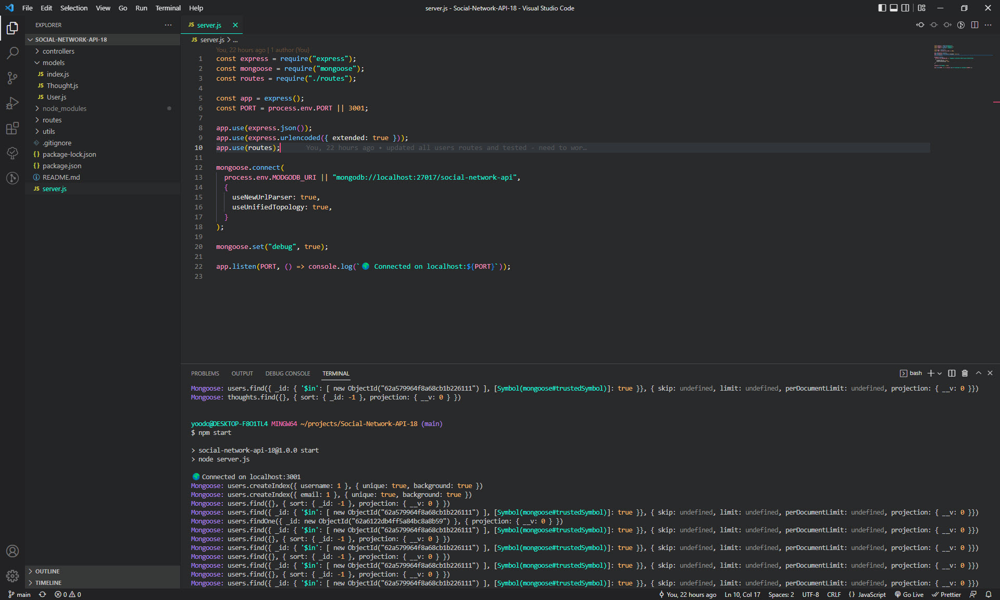

During week 18 of UTSA's Coding Bootcamp, we were given a directive of creating an API for my social network that uses a NoSQL database. There were a number of requirements to meet, such as:

```
GIVEN a social network API
WHEN I enter the command to invoke the application
THEN my server is started and the Mongoose models are synced to the MongoDB database
WHEN I open API GET routes in Insomnia for users and thoughts
THEN the data for each of these routes is displayed in a formatted JSON
WHEN I test API POST, PUT, and DELETE routes in Insomnia
THEN I am able to successfully create, update, and delete users and thoughts in my database
WHEN I test API POST and DELETE routes in Insomnia
THEN I am able to successfully create and delete reactions to thoughts and add and remove friends to a user’s friend list
```

This challenge came with no starter code, so all of it was compelted by me in VS Code and saved in GitHub. This project used ExpressJS, Mongoose, Insomnia, VSCode, and GitHub.

You can find my repo code here: https://github.com/amhernandez1163/Social-Network-API-18

The YouTube DEMO can be found here: https://www.youtube.com/watch?v=MzlSEvoT9tU (resolution goes up to 1080p - please adjust for quality)


